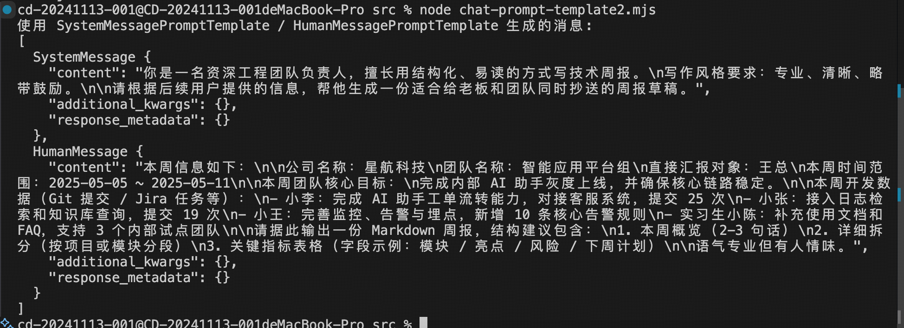

prompt 毫无疑问是 AI Agent 中最核心的部分。

我们调用大模型完成各种功能，都是在 prompt 里描述的。

但这节不讲 prompt 怎么写，因为在公司里有专门的产品部门负责写 prompt，我们要学的是如何管理它。

比如 prompt 之间的组合，prompt 里的示例的管理等。

# 简单示例

 Prompt Template 的第一个案例, 定义了一个 Prompt Template，其中有一些占位符。

用的时候通过 format 方法传入占位符的具体内容。

之后给大模型填充数据之后的 prompt 来生成回答。


```js
const naiveTemplate = PromptTemplate.fromTemplate(`
你是一名严谨但不失人情味的工程团队负责人，需要根据本周数据写一份周报。

公司名称：{company_name}
部门名称：{team_name}
直接汇报对象：{manager_name}
本周时间范围：{week_range}

本周团队核心目标：
{team_goal}

本周开发数据（Git 提交 / Jira 任务）：
{dev_activities}

请根据以上信息生成一份【Markdown 周报】，要求：
- 有简短的整体 summary（两三句话）
- 有按模块/项目拆分的小结
- 用一个 Markdown 表格列出关键指标（字段示例：模块 / 亮点 / 风险 / 下周计划）
- 语气专业但有一点人情味，适合作为给老板和团队抄送的周报。
`);

const prompt = await naiveTemplate.format({
    company_name: '星航科技',
    team_name: '数据智能平台组',
    manager_name: '刘总',
    week_range: '2025-03-10 ~ 2025-03-16',
    team_goal: '完成用户画像服务的灰度上线，并验证核心指标是否达标。',
    dev_activities:
        '- 阿兵：完成用户画像服务的 Canary 发布与回滚脚本优化，提交 27 次，相关任务：DATA-321 / DATA-335\n' +
        '- 小李：接入埋点数据，打通埋点 → Kafka → DWD → 画像服务的全链路，提交 22 次\n' +
        '- 小赵：完善画像服务的告警与Dashboard，新增 8 个告警规则，提交 15 次\n' +
        '- 小周：配合产品输出 A/B 实验报表，支持 3 条对外汇报用数据',
});

const stream = await model.stream(prompt);

for await (const chunk of stream) {
    process.stdout.write(chunk.content);
}
```

现在都是一整个的 prompt，实际上可能需要按照角色、背景、任务、格式等来拆分管理prompt，这样用的时候再组合。

```js
// A. 人设模块（导出以便在其他场景复用）
export const personaPrompt = PromptTemplate.fromTemplate(
    `你是一名资深工程团队负责人，写作风格：{tone}。
你擅长把枯燥的技术细节写得既专业又有温度。\n`
);

// B. 背景模块（导出以便在其他场景复用）
export const contextPrompt = PromptTemplate.fromTemplate(
    `公司：{company_name}
部门：{team_name}
直接汇报对象：{manager_name}
本周时间范围：{week_range}
本周部门核心目标：{team_goal}\n`
);

// C. 任务模块
const taskPrompt = PromptTemplate.fromTemplate(
    `以下是本周团队的开发活动（Git / Jira 汇总）：
{dev_activities}

请你从这些原始数据中提炼出：
1. 本周整体成就亮点
2. 潜在风险和技术债
3. 下周重点计划建议\n`
);

// D. 格式模块
const formatPrompt = PromptTemplate.fromTemplate(
    `请用 Markdown 输出周报，结构包含：
1. 本周概览（2-3 句话的 Summary）
2. 详细拆分（按模块或项目分段）
3. 关键指标表格，表头为：模块 | 亮点 | 风险 | 下周计划

注意：
- 尽量引用一些具体数据（如提交次数、完成的任务编号）
- 语气专业，但可以偶尔带一点轻松的口吻，符合 {company_values}。
`
);

// E. 最终组合 Prompt（把上面几个模块拼在一起）
const finalWeeklyPrompt = PromptTemplate.fromTemplate(
    `{persona_block}
{context_block}
{task_block}
{format_block}

现在请生成本周的最终周报：`
);

export const pipelinePrompt = new PipelinePromptTemplate({
    pipelinePrompts: [
        { name: 'persona_block', prompt: personaPrompt },
        { name: 'context_block', prompt: contextPrompt },
        { name: 'task_block', prompt: taskPrompt },
        { name: 'format_block', prompt: formatPrompt },
    ],
    finalPrompt: finalWeeklyPrompt
});

const pipelineFormatted = await pipelinePrompt.format({
    tone: '专业、清晰、略带幽默',
    company_name: '星航科技',
    team_name: 'AI 平台组',
    manager_name: '王总',
    week_range: '2025-02-03 ~ 2025-02-09',
    team_goal: '完成智能周报 Agent 的 MVP 版本，并打通 Git / Jira 数据源。',
    dev_activities:
        '- Git: 58 次提交，3 个主要分支合并\n' +
        '- Jira: 完成 12 个 Story，关闭 7 个 Bug\n' +
        '- 关键任务：完成智能周报 Pipeline 设计、实现 Prompt 拆分、接入 ExampleSelector',
    company_values: '「极致、开放、靠谱」的价值观',
});
```

这么多 inputVariables，其实有的是比较固定的，比如公司名、经理名等。

可以用 partial 来预填入一些变量，生成新的 PromptTemplate。

```js
const pipelineWithPartial = await pipelinePrompt.partial({
    company_name: '星航科技',
    company_values: '「极致、开放、靠谱」的价值观',
    tone: '偏正式但不僵硬',
});
```

PromptTemplate 产出的就是一个字符串，实际上我们更多是用 SystemMesage、HumanMessage、AIMessage、ToolMessage 的 messages 数组来调大模型：

这种就需要 ChatPromptTemplate 了。

```js
const chatPrompt = ChatPromptTemplate.fromMessages([
  [
    'system',
    `你是一名资深工程团队负责人，擅长用结构化、易读的方式写技术周报。
写作风格要求：{tone}。

请根据后续用户提供的信息，帮他生成一份适合给老板和团队同时抄送的周报草稿。`,
  ],
  [
    'human',
    `本周信息如下：

公司名称：{company_name}
团队名称：{team_name}
直接汇报对象：{manager_name}
本周时间范围：{week_range}

本周团队核心目标：
{team_goal}

本周开发数据（Git 提交 / Jira 任务等）：
{dev_activities}

请据此输出一份 Markdown 周报，结构建议包含：
1. 本周概览（2-3 句话）
2. 详细拆分（按项目或模块分段）
3. 关键指标表格（字段示例：模块 / 亮点 / 风险 / 下周计划）

语气专业但有人情味。`,
  ],
]);

const chatMessages = await chatPrompt.formatMessages({
  tone: '专业、清晰、略带鼓励',
  company_name: '星航科技',
  team_name: '智能应用平台组',
  manager_name: '王总',
  week_range: '2025-05-05 ~ 2025-05-11',
  team_goal: '完成内部 AI 助手灰度上线，并确保核心链路稳定。',
  dev_activities:
    '- 小李：完成 AI 助手工单流转能力，对接客服系统，提交 25 次\n' +
    '- 小张：接入日志检索和知识库查询，提交 19 次\n' +
    '- 小王：完善监控、告警与埋点，新增 10 条核心告警规则\n' +
    '- 实习生小陈：补充使用文档和 FAQ，支持 3 个内部试点团队',
});

```

PipelinePromptTemplate 一般就是这样用。

这里我们复用了之前的两个 PromptTemplate，然后创建了两个新的 PromptTemplate，最终的 finalPrompt 是 ChatPromptTemplate，然后用 formatPromptValue 这个方法拿到填入变量后的 messages 数组。
```js
const weeklyTaskPrompt = PromptTemplate.fromTemplate(
  `以下是本周与你所在团队相关的关键事实与数据（Git / Jira / 运维等）：
{dev_activities}

请你基于这些信息，帮我生成一份【技术周报】，重点包含：
1. 本周整体达成情况
2. 关键成果与亮点
3. 主要问题 / 风险
4. 下周的改进方向与优先级建议
`
);

// B. 本场景自己的格式要求模块
const weeklyFormatPrompt = PromptTemplate.fromTemplate(
  `请用 Markdown 写这份周报，结构建议为：
1. 本周概览（2-3 句话）
2. 详细拆分（按项目或模块分段）
3. 关键指标表格（字段示例：模块 / 亮点 / 风险 / 下周计划）

语气要求：{tone}，既专业清晰，又适合发给老板并抄送团队。`
);

// C. 最终的 ChatPromptTemplate：接收由 Pipeline 拼好的几块内容
const finalChatPrompt = ChatPromptTemplate.fromMessages([
  [
    'system',
    `你是一名资深工程团队负责人，擅长把复杂的技术细节总结成结构化、易读的周报。

下面是一些已经预先整理好的信息块，请你综合理解后，再根据用户补充的信息生成周报。`,
  ],
  [
    'human',
    `人设与写作风格：
{persona_block}

团队与本周背景：
{context_block}

任务与输入数据：
{task_block}

输出格式要求：
{format_block}

现在请基于以上信息，直接输出最终的周报内容。`,
  ],
]);

const weeklyChatPipelinePrompt = new PipelinePromptTemplate({
  pipelinePrompts: [
    { name: 'persona_block', prompt: personaPrompt },     // 复用人设
    { name: 'context_block', prompt: contextPrompt },     // 复用背景
    { name: 'task_block', prompt: weeklyTaskPrompt },     // 本文件自己的任务模块
    { name: 'format_block', prompt: weeklyFormatPrompt }, // 本文件自己的格式模块
  ],
  // 注意：这里的 finalPrompt 是 ChatPromptTemplate，而不是普通 PromptTemplate
  finalPrompt: finalChatPrompt
});

// E. 示例：构造一份消息数组并喂给 Chat 模型
const promptValue = await weeklyChatPipelinePrompt.formatPromptValue({
  tone: '专业、清晰、略带鼓励',
  company_name: '星航科技',
  team_name: 'AI 平台组',
  manager_name: '王总',
  week_range: '2025-05-12 ~ 2025-05-18',
  team_goal: '完成周报自动生成能力的灰度验证，并收集团队反馈。',
  dev_activities:
    '- Git：本周合并 4 个主要特性分支，包含 Prompt 配置化和日志观测优化\n' +
    '- Jira：关闭 9 个 Story / 5 个 Bug，新增 2 个 TechDebt 任务\n' +
    '- 运维：本周线上 P1 事故 0 起，P2 1 起（由配置变更引起，已完成复盘）\n' +
    '- 其他：完成与数据平台、运维平台两次联合评审会议',
});

console.log('Pipeline + ChatPromptTemplate 生成的消息:');
console.log(promptValue.toChatMessages());

```

ChatPromptTemplate还有另外一种用法：

```js
const systemTemplate = SystemMessagePromptTemplate.fromTemplate(
  `你是一名资深工程团队负责人，擅长用结构化、易读的方式写技术周报。
写作风格要求：{tone}。

请根据后续用户提供的信息，帮他生成一份适合给老板和团队同时抄送的周报草稿。`
);

const humanTemplate = HumanMessagePromptTemplate.fromTemplate(
  `本周信息如下：

公司名称：{company_name}
团队名称：{team_name}
直接汇报对象：{manager_name}
本周时间范围：{week_range}

本周团队核心目标：
{team_goal}

本周开发数据（Git 提交 / Jira 任务等）：
{dev_activities}

请据此输出一份 Markdown 周报，结构建议包含：
1. 本周概览（2-3 句话）
2. 详细拆分（按项目或模块分段）
3. 关键指标表格（字段示例：模块 / 亮点 / 风险 / 下周计划）

语气专业但有人情味。`
);

const composedTemplate = ChatPromptTemplate.fromMessages([
  systemTemplate,
  humanTemplate,
]);

const chatMessages = await composedTemplate.formatMessages({
  tone: '专业、清晰、略带鼓励',
  company_name: '星航科技',
  team_name: '智能应用平台组',
  manager_name: '王总',
  week_range: '2025-05-05 ~ 2025-05-11',
  team_goal: '完成内部 AI 助手灰度上线，并确保核心链路稳定。',
  dev_activities:
    '- 小李：完成 AI 助手工单流转能力，对接客服系统，提交 25 次\n' +
    '- 小张：接入日志检索和知识库查询，提交 19 次\n' +
    '- 小王：完善监控、告警与埋点，新增 10 条核心告警规则\n' +
    '- 实习生小陈：补充使用文档和 FAQ，支持 3 个内部试点团队',
});
```

最后组成的消息如图所示

那如果我是想插入一段聊天记录呢？

这种就要用 MessagesPlaceholder 了。

```js
const chatPromptWithHistory = ChatPromptTemplate.fromMessages([
  [
    'system',
    `你是一名资深工程效率顾问，善于在多轮对话的上下文中给出具体、可执行的建议。`,
  ],
  // 这里用 MessagesPlaceholder 来承载「之前的多轮对话」
  new MessagesPlaceholder('history'),
  [
    'human',
    `这是用户本轮的新问题：{current_input}

请结合上面的历史对话，一并给出你的建议。`,
  ],
]);

// 3. 构造一个模拟的历史对话 + 当前输入
const historyMessages = [
  {
    role: 'human',
    content: '我们团队最近在做一个内部的周报自动生成工具。',
  },
  {
    role: 'ai',
    content:
      '听起来不错，可以先把数据源（Git / Jira / 运维）梳理清楚，再考虑 Prompt 模块化设计。',
  },
  {
    role: 'human',
    content: '我们已经把 Prompt 拆成了「人设」「背景」「任务」「格式」四块。',
  },
  {
    role: 'ai',
    content:
      '很好，接下来可以考虑把这些模块做成可复用的 PipelinePromptTemplate，方便在不同场景复用。',
  },
];

const formattedMessages = await chatPromptWithHistory.formatPromptValue({
  history: historyMessages,
  current_input: '现在我们想再优化一下多人协同编辑周报的流程，有什么建议？',
});
```

最后还有一个 FewShotPromptTemplate。

也就是生成一些带少量示例的 prompt。

```js
const examplePrompt = PromptTemplate.fromTemplate(
  `用户输入：{user_requirement}
期望周报结构：{expected_style}
模型示例输出片段：
{report_snippet}
---`
);

// 3. 准备几条示例数据（few-shot examples）
const examples = [
  {
    user_requirement:
      '重点突出稳定性治理，本周主要在修 Bug 和清理技术债，适合发给偏关注风险的老板。',
    expected_style: '语气稳健、偏保守，多强调风险识别和已做的兜底动作。',
    report_snippet:
      `- 支付链路本周共处理线上 P1 Bug 2 个、P2 Bug 3 个，全部在 SLA 内完成修复；\n` +
      `- 针对历史高频超时问题，完成 3 个核心接口的超时阈值和重试策略优化；\n` +
      `- 清理 12 条重复/噪音告警，减少值班同学 30% 的告警打扰。`,
  },
  {
    user_requirement:
      '偏向对外展示成果，希望多写一些亮点，适合发给更大范围的跨部门同学。',
    expected_style: '语气积极、突出成果，对技术细节做适度抽象。',
    report_snippet:
      `- 新上线「订单实时看板」，业务侧可以实时查看核心转化漏斗；\n` +
      `- 首次打通埋点 → 数据仓库 → 实时服务链路，为后续精细化运营提供基础能力；\n` +
      `- 和产品、运营一起完成 2 场内部分享，会后收到 15 条正向反馈。`,
  },
];

// 4. 把示例封装成 FewShotPromptTemplate
const fewShotPrompt = new FewShotPromptTemplate({
  examples,
  examplePrompt,
  prefix:
    `下面是几条已经写好的【周报示例】，你可以从中学习语气、结构和信息组织方式：\n`,
  suffix:
    `\n基于上面的示例风格，请帮我写一份新的周报。` +
    `\n如果用户有额外要求，请在满足要求的前提下，尽量保持示例中的结构和条理性。`,
  inputVariables: [],
});

const fewShotBlock = await fewShotPrompt.format({});
```

很明显，FewShotPromptTemplate 可以结合其他 PromptTemplate 一起用，通过
PipelinePromptTemplate 组合到一块。


这节我们学了 Prompt Template 相关的 api。
主要有这些：
- PromptTemplate：提示词模版，可以填入占位符变量
- ChatPromptTemplate：对话形式（messages 数组）的提示词模版
- FewShotPromptTemplate：生成带示例的提示词模版
- FewShotChatTemplatePromptTemplate：生成带示例的提示词模版，对话形式
- LengthBasedExampleSelector：根据长度选择合适的示例
- SemanticSimilarityExampleSelector：选择语义相近的示例
- ipelinePromptTemplate：合并多个 Prompt Template 成一个大的 Prompt Template
- 有了这些 prompt template 的 api，就可以用组件化的方式来管理 prompt 了，用到的时候
再组合。