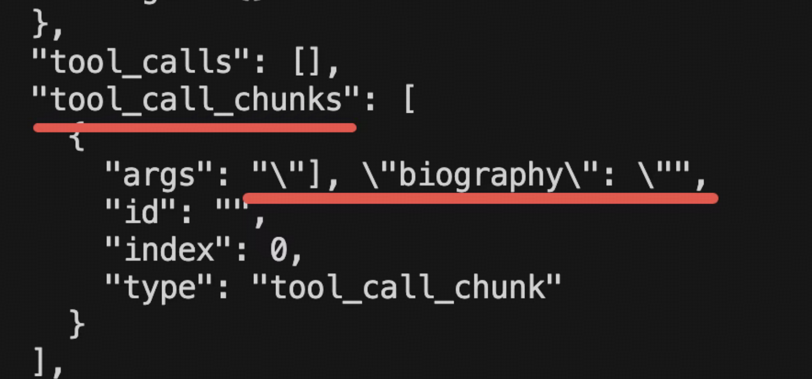

# 大模型输出
我们已经调用大模型完成过很多功能了，但输出一直没做控制，都是自然语言的形式。

而很多情况下，我们希望大模型按照我们的格式要求，返回一个 json这就需要用到 output parser 的 api 了。

```js

import { JsonOutputParser } from '@langchain/core/output_parsers';

// 初始化模型
const model = new ChatOpenAI({
    modelName: process.env.MODEL_NAME,
    apiKey: process.env.OPENAI_API_KEY,
    temperature: 0,
    configuration: {
        baseURL: process.env.OPENAI_BASE_URL,
    },
});

const parser = new JsonOutputParser();

const question = `请介绍一下爱因斯坦的信息。请以 JSON 格式返回，包含以下字段：name（姓名）、birth_year（出生年份）、nationality（国籍）、major_achievements（主要成就，数组）、famous_theory（著名理论）。

${parser.getFormatInstructions()}`;

const response = await model.invoke(question);

const result = await parser.parse(response.content);

```

用 StructuredOutputParser，它可以指定具体的 json 结构

```js
// 定义输出结构
const parser = StructuredOutputParser.fromNamesAndDescriptions({
    name: "姓名",
    birth_year: "出生年份",
    nationality: "国籍",
    major_achievements: "主要成就，用逗号分隔的字符串",
    famous_theory: "著名理论"
});


const question = `请介绍一下爱因斯坦的信息。

${parser.getFormatInstructions()}`;

const response = await model.invoke(question);

const result = await parser.parse(response.content);

```

StructuredOutputParser 也可以用 zod 来描述复杂的对象格式。

```js
import { StructuredOutputParser } from'@langchain/core/output_parsers';

const scientistSchema = z.object({
    name: z.string().describe("科学家的全名"),
    birth_year: z.number().describe("出生年份"),
    death_year: z.number().optional().describe("去世年份，如果还在世则不填"),
    nationality: z.string().describe("国籍"),
    fields: z.array(z.string()).describe("研究领域列表"),
    awards: z.array(
        z.object({
            name: z.string().describe("奖项名称"),
            year: z.number().describe("获奖年份"),
            reason: z.string().optional().describe("获奖原因")
        })
    ).describe("获得的重要奖项列表"),
    major_achievements: z.array(z.string()).describe("主要成就列表"),
    famous_theories: z.array(
        z.object({
            name: z.string().describe("理论名称"),
            year: z.number().optional().describe("提出年份"),
            description: z.string().describe("理论简要描述")
        })
    ).describe("著名理论列表"),
    education: z.object({
        university: z.string().describe("主要毕业院校"),
        degree: z.string().describe("学位"),
        graduation_year: z.number().optional().describe("毕业年份")
    }).optional().describe("教育背景"),
    biography: z.string().describe("简短传记，100字以内")
});

const parser = StructuredOutputParser.fromZodSchema(scientistSchema);

const question = `请介绍一下居里夫人（Marie Curie）的详细信息，包括她的教育背景、研究领域、获得的奖项
${parser.getFormatInstructions()}` // 还是需要再prompt里面使用 

const response = await model.invoke(question);

const result = await parser.parse(response.content); // 解析结果

```

**tool 可以指定参数的对象格式，能不能直接用 tool 来获取结构化的结果呢？**

**当然可以的。**

```js
const model = new ChatOpenAI({
    modelName: process.env.MODEL_NAME,
    apiKey: process.env.OPENAI_API_KEY,
    temperature: 0,
    configuration: {
        baseURL: process.env.OPENAI_BASE_URL,
    },
});

// 定义结构化输出的 schema
const scientistSchema = z.object({
    name: z.string().describe("科学家的全名"),
    birth_year: z.number().describe("出生年份"),
    nationality: z.string().describe("国籍"),
    fields: z.array(z.string()).describe("研究领域列表"),
});

const modelWithTool = model.bindTools([
    {
        name: "extract_scientist_info",
        description: "提取和结构化科学家的详细信息",
        schema: scientistSchema
    }
]);

// 调用模型
const response = await modelWithTool.invoke("介绍一下爱因斯坦");

const result = response.tool_calls[0].args;

console.log("结构化结果:", JSON.stringify(result, null, 2));
console.log(`\n姓名: ${result.name}`);
console.log(`出生年份: ${result.birth_year}`);
console.log(`国籍: ${result.nationality}`);
console.log(`研究领域: ${result.fields.join(', ')}`);

```

可以看到，通过返回的 tool_calls 信息，也能拿到结构化的数据。

而且，这种方式比 output parser 更好。

因为模型训练的时候就保证了生成 tool calls 的参数一定是符合格式要求的，如果不符合，会重新生成。

那岂不是没必要用 output parser 了？确实，如果只是要求结构化返回数据，用 tool 就行了。
所以，现在获取结构化数据一般会用 **withStructuredOutput** 这个 api
它会判断模型是否支持 tool calls，支持的话就用 tool 的方式获取**结构化数据**(什么是结构化数据呢？有一种场景就说获取结果json直接保存到数据库)，否则用
output parser 的方式，不用我们自己去处理。

```js
// 定义结构化输出的 schema
const scientistSchema = z.object({
    name: z.string().describe("科学家的全名"),
    birth_year: z.number().describe("出生年份"),
    nationality: z.string().describe("国籍"),
    fields: z.array(z.string()).describe("研究领域列表"),
});

// 使用 withStructuredOutput 方法 不适合流式打印
const structuredModel = model.withStructuredOutput(scientistSchema);

// 调用模型
const result = await structuredModel.invoke("介绍一下爱因斯坦");

console.log("结构化结果:", JSON.stringify(result, null, 2));
console.log(`\n姓名: ${result.name}`);
console.log(`出生年份: ${result.birth_year}`);
console.log(`国籍: ${result.nationality}`);
console.log(`研究领域: ${result.fields.join(', ')}`);
```

使用output parser获流式输出

```js
const schema = z.object({
    name: z.string().describe("姓名"),
    birth_year: z.number().describe("出生年份"),
    death_year: z.number().describe("去世年份"),
    nationality: z.string().describe("国籍"),
    occupation: z.string().describe("职业"),
    famous_works: z.array(z.string()).describe("著名作品列表"),
    biography: z.string().describe("简短传记")
});
const parser = StructuredOutputParser.fromZodSchema(schema);

const prompt = `详细介绍莫扎特的信息。\n\n${parser.getFormatInstructions()}`;

console.log("🌊 流式结构化输出演示\n");

const stream = await model.stream(prompt);

    let fullContent = '';
    let chunkCount = 0;

    console.log("📡 接收流式数据:\n");

    for await (const chunk of stream) {
        chunkCount++;
        const content = chunk.content;
        fullContent += content;

        process.stdout.write(content); // 实时显示流式文本
}

    // 解析完整内容为结构化数据
    const result = await parser.parse(fullContent);

```

所以流式的情况下，用 output parser 还是更适合的。

那如果我们就是想用 tool calls 来做结构化输出，但还是想要流式的打印，怎么办呢？

其实流式输出的情况下，如果你用了 tool call，是这样返回的



tool_call_chunks 里保存了 tool 参数的部分内容，我们可以用这个来实现流式打印效果

```js
// 定义结构化输出的 schema
const scientistSchema = z.object({
    name: z.string().describe("科学家的全名"),
    birth_year: z.number().describe("出生年份"),
    death_year: z.number().optional().describe("去世年份，如果还在世则不填"),
    nationality: z.string().describe("国籍"),
    fields: z.array(z.string()).describe("研究领域列表"),
    achievements: z.array(z.string()).describe("主要成就"),
    biography: z.string().describe("简短传记")
});

// 绑定工具到模型
const modelWithTool = model.bindTools([
    {
        name: "extract_scientist_info",
        description: "提取和结构化科学家的详细信息",
        schema: scientistSchema
    }
]);

    // 开启流式输出
    const stream = await modelWithTool.stream("详细介绍牛顿的生平和成就");

    console.log("📡 实时输出流式 tool_calls_chunk:\n");

    let chunkIndex = 0;

    for await (const chunk of stream) {
        chunkIndex++;
        console.log(chunk);
        // 直接打印每个 chunk 的 tool_calls 信息
        if (chunk.tool_call_chunks && chunk.tool_call_chunks.length > 0) {
            process.stdout.write(chunk.tool_call_chunks[0].args || '');
        }
    }

    console.log("\n\n✅ 流式输出完成");
```

如果我想参数不完整的时候，也能拿到 tool_call 参数的 json 呢？

这种就可以用 JsonOutputToolsParser 了

它的作用就是解析 tool_call_chunks 中的内容，拼接成符合 json 格式规范的对象，就算
chunk 还没传输完的时候，也能拿到 json 对象

```js
// 定义结构化输出的 schema
const scientistSchema = z.object({
    name: z.string().describe("科学家的全名"),
    birth_year: z.number().describe("出生年份"),
    death_year: z.number().optional().describe("去世年份，如果还在世则不填"),
    nationality: z.string().describe("国籍"),
    fields: z.array(z.string()).describe("研究领域列表"),
    achievements: z.array(z.string()).describe("主要成就"),
    biography: z.string().describe("简短传记")
});


// 绑定工具到模型
const modelWithTool = model.bindTools([
    {
        name: "extract_scientist_info",
        description: "提取和结构化科学家的详细信息",
        schema: scientistSchema
    }
]);

// 1. 绑定工具并挂载解析器
const parser = new JsonOutputToolsParser(); // JsonOutputToolsParser 会试试解析 tool_call_chunks 生成完整的 tool_calls 信息
const chain = modelWithTool.pipe(parser);

try {
    // 2. 开启流
    const stream = await chain.stream("详细介绍牛顿的生平和成就");

    let lastContent = ""; // 记录已打印的完整内容
    let finalResult = null; // 存储最终的完整结果

    console.log("📡 实时输出流式内容:\n");

    for await (const chunk of stream) {
        // console.log(chunk);

        if (chunk.length > 0) {
            const toolCall = chunk[0];

            // 获取当前工具调用的完整参数内容
            const currentContent = JSON.stringify(toolCall.args || {}, null, 2);

            if (currentContent.length > lastContent.length) {
                const newText = currentContent.slice(lastContent.length);
                process.stdout.write(newText); // 实时输出到控制台
                lastContent = currentContent; // 更新已读进度
            }

            console.log(toolCall.args);
        }
    }

    console.log("\n\n✅ 流式输出完成");

} catch (error) {
    console.error("\n❌ 错误:", error.message);
    console.error(error);
}
```
此外，我们前面说 withStructuredOutput 不适合的场景有两个：

- 流式打印内容，这种还是需要 Output Parser
- XML、YAML 等非 json 格式，也需要 Output Parser

我们经常需要对大模型输出做一些结构化的限制，这时候就需要 output parser 的 api
它的原理就是在提示词里加入格式信息，然后对结果做一下 parse
比如 JsonOutputParser、StructuredOutputParser、XMLOutputParser 等

当然，用 tool call 的方式也完全可以实现结构化限制，而且可靠性更高，是模型训练的时候
就保证的，所以，如果是做结构化，直接用 withStructuredOutput 这个 api 就行，它底层就是根据模型来决定是用 tool call 还是 output parser。

但它有两个不适合的场景：

流式打印，这种需要用 output parser。

xml 等非 json 格式，也需要 output parser。

此外，如果流式打印 tool 参数的过程中，想实时拿到 tool_calls 的 json 对象来调用 tool，
可以用 JsonOutputToolsParser 这个 output parser。

综上，如果你需要做大模型的输出做结构化，就可以考虑 withStructuredOutput 和 output
parser 这两者二选一了。

前面讲 withStructuredOutput 底层是 tool、output parser，其实还有一种
特性 JSON Schema

```js
import { zodToJsonSchema } from "zod-to-json-schema";
import { HumanMessage, SystemMessage } from '@langchain/core/messages';

const scientistSchema = z.object({
    name: z.string().describe("科学家的全名"),
    birth_year: z.number().describe("出生年份"),
    field: z.string().describe("主要研究领域"),
    achievements: z.array(z.string()).describe("主要成就列表")
}).strict();

// 将 Zod 转换为原生的 JSON Schema 格式
const nativeJsonSchema = zodToJsonSchema(scientistSchema);

const model = new ChatOpenAI({
    modelName: "qwen-max",
    temperature: 0,
    apiKey: process.env.OPENAI_API_KEY,
    configuration: {
        baseURL: process.env.OPENAI_BASE_URL,
    },
    modelKwargs: { // 通过 modelKwargs 传入原生参数 JSONSCHEMA的模式
        response_format: {
            type: "json_schema",
            json_schema: {
                name: "scientist_info",
                strict: true,
                schema: nativeJsonSchema // 这里的 nativeJsonSchema 就是转换后的对象
            }
        }
    }
});

const res = await model.invoke([
        new SystemMessage("你是一个信息提取助手，请直接返回 JSON 数据。"),
        new HumanMessage("介绍一下杨振宁")
    ]);

    console.log(chalk.green("\n✅ 收到响应 (纯净 JSON):"));
    console.log(res.content); 

    const data = JSON.parse(res.content);
    console.log(chalk.cyan("\n📋 解析后的对象:"));
    console.log(data);

```

指定大模型的输出格式为 json_schema 指定格式，它就会按照这个格式输出。